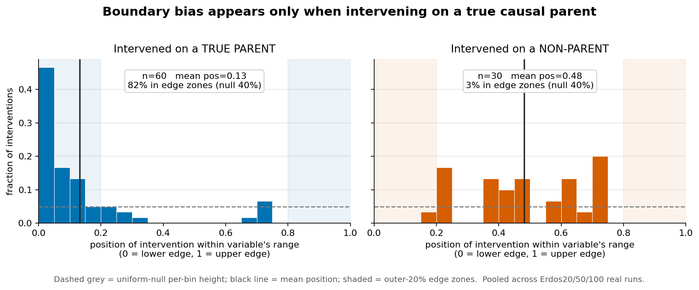
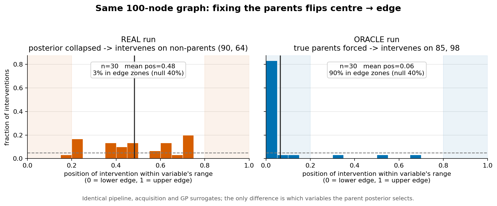
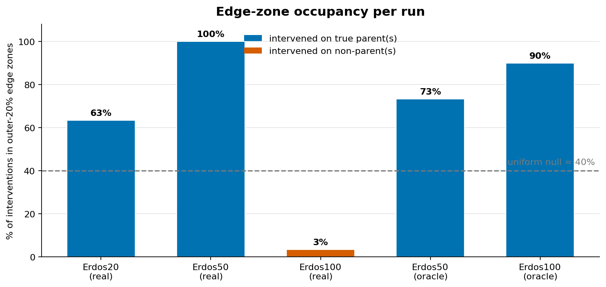

# Does CBO-U select interventions on the boundary? Experiments and findings

## Motivation

In Causal Bayesian Optimisation with an unknown graph (CBO-U, the
`PARENT_SCALE` doubly-robust variant), each trial the algorithm (i) maintains a
posterior over which variables are the parents of the target, (ii) forms an
*exploration set* from the surviving parent hypotheses, and (iii) picks an
intervention by maximising a causal Expected-Improvement acquisition over a
GP surrogate of the do-effect `E[Y | do(X = x)]`.

For a noiseless **linear** SEM the causal effect of a genuine parent on the
target is monotonic, so the value-minimising intervention should sit at an
*extreme* of the variable's allowed range. The working hypothesis was therefore
that CBO-U should exhibit a **boundary bias** — intervention values clustering
at the edges of the range — and that this should hold as graphs grow. The
observation that prompted this investigation was that on large graphs
(Erdos100) interventions did **not** appear to hug the boundary, *and* the
parent posterior was inaccurate. The two questions:

1. Is there a boundary bias at all, and does it hold at scale?
2. Why is the posterior inaccurate, and is it related to (1)?

## Experimental setup

All runs use `PARENT_SCALE` (CBO-U, `dr2`, `individual=True`), noiseless linear
Erdos–Rényi SEMs, `n_obs = 200` observational samples, 30 CBO trials, seed 71.
Three graph sizes: Erdos20 (target `18`, true parents `{4}`), Erdos50 (target
`23`, true parents `{19, 49}`), Erdos100 (target `80`, true parents `{85, 98}`).
Per iteration we record the chosen intervention (variable + value), the parent
posterior, and a strict boundary flag.

To test the boundary question rigorously we work from the recorded intervention
values directly. For each intervened dimension we compute its **normalised
position** in the variable's range,

```
p = (value − lower) / (upper − lower)   ∈ [0, 1],
```

and its distance to the nearest edge `d = min(p, 1 − p)`. Under a uniform-null
(intervention values chosen at random in the range) the deciles of `p` are flat,
`E[d] = 0.25`, and the fraction landing in the outer-20% edge zones
(`p < 0.2` or `p > 0.8`) is 40%. Everything is compared against this null, with
a one-sided binomial test on the outer-band count.
(Analysis: `results_erdos/boundary_bias_analysis.py`.)

## Finding 1 — a boundary bias exists, but only on true parents

Splitting every intervention by whether the intervened variable is an actual
parent of the target gives a clean separation.



- **True-parent interventions** (n = 60, pooled Erdos20+50): mean position
  **0.13**, **82%** in the outer-20% edge zones vs a 40% null
  (binomial p = 4.6 × 10⁻¹¹), mean distance-to-edge 0.10. They pile up at the
  **lower** edge specifically — consistent with pushing a monotone parent down
  to minimise the target.
- **Non-parent interventions** (n = 30, all from Erdos100): mean position
  **0.48**, **3%** in the edge zones (not distinguishable from — in fact below —
  the null), mean distance-to-edge 0.35. They sit in the **centre** of the
  range.

So the boundary bias is real and highly significant, but it is *conditional* on
intervening on a variable that genuinely drives the target.

## Finding 2 — the posterior collapses onto the wrong variables (worst at scale)

Diagnostics on the recorded posteriors (`boundary_tracking_diagnostics.py`)
showed that for larger graphs the exploration set collapses, at **iteration 0
— before any CBO trial** — onto too few, and often wrong, candidate parents:

- Erdos20: candidate set = `{4}` (correct).
- Erdos50: candidate set collapses to `{49}` — one of the two true parents;
  variable `19` is dropped and never returns.
- Erdos100: candidate set = `{90}`/`{64}` — **neither** true parent; `85` and
  `98` are absent from iteration 0 onward.

Because the candidate set can only *shrink* after iteration 0 (hypotheses are
deleted, never re-added), a true parent that is missing at the cold start is
locked out for the whole run. Erdos100 therefore spent all 30 trials
intervening on non-causal variables `90`/`64`.

Isolating the cold-start step (`cold_start_bootstrap_dump.py`, Erdos50) showed
the doubly-robust bootstrap itself is **not** the whole story: 8 of 10 bootstrap
draws *do* contain both true parents `{19, 49}` — but nearly every draw also
adds false positives, so the *exact* true set gets only 20% of the mass, and the
subsequent Bayesian update from the initial interventional data collapses this
to the single wrong-ish `{49}`. (The bootstrap resampling is also unseeded, a
reproducibility gap.) Root cause of the bad posterior: **false-positive-heavy
parent identification plus an over-aggressive initial collapse**, amplified as
the candidate pool grows with graph size.

## Finding 3 — the confound-closing experiment: fixing the parents flips centre → edge

Findings 1 and 2 suggest the "no boundary bias on Erdos100" is simply a
*consequence* of intervening on non-parents — not a failure of the boundary
mechanism at scale. But in the three real runs, "true parent" is perfectly
confounded with "small/medium graph". To break the confound we re-ran Erdos50
and Erdos100 with an **oracle**: the parent posterior is forced to the true
parent set (probability 1.0), bypassing the bootstrap, while **everything else
in the pipeline — the acquisition, the GP surrogates, the boundary tracking —
is byte-for-byte identical** (`oracle_boundary_tracking_script.py`; the only
changed line replaces `determine_initial_probabilities`).



On the **same 100-node graph**, forcing the true parents flips the behaviour
completely:

| Erdos100 | intervenes on | outer-20% band | mean position | verdict |
|---|---|---|---|---|
| Real   | non-parents `90`, `64` | 3%  | 0.48 | no bias (centre) |
| Oracle | true parents `85`, `98` | **90%** | **0.06** | strong edge bias |

The strict boundary percentage went 0.00 → 0.47, and 26 of 30 interventions
land in the lowest decile of the range. The Erdos50 oracle is a positive
control and stays edge-biased (73%). The summary across all runs:



Every run that intervenes on true parents — regardless of graph size — is far
above the 40% null; the single exception is Erdos100-real, which fails only
because it selected the wrong variables. Erdos100-oracle, immediately beside it,
reaches 90%.

## Why is there *no* boundary behaviour on a non-parent?

This is mechanistic, and follows from the code path. The acquisition's GP prior
mean **is** the do-effect `E[Y | do(X = x)]`, computed by propagating the
intervention through the fitted SEM (`causal_effect_DO` in `graphs/graph.py`).
For a hypothesised parent, the target is regressed on that variable from
observational data (`functions[target]`). When the hypothesis is *wrong*, the
variable carries no information about the target, so this regression has
**~zero slope** and the do-effect surface is **flat**:

```
E[Y | do(90 = x)]  =  functions[target].predict(90 = x)  ≈  mean(Y)   for all x.
```

The flatness is not a coincidence — it is the same fact as the parent being
wrong: the model is regressing the target on a variable that does not explain
it. A flat surface gives the optimiser no gradient toward either edge, so the
intervention settles in the data-dense centre (the observational mean, where the
GP is best determined) rather than extrapolating to the sparse range extremes.
A **true** parent gives a real slope → a monotone surface → the acquisition's
optimum sits at the edge. This is exactly what the data shows: non-parent
interventions land at the variable's observational mean (position ≈ 0.5), true
parents at the edge (position ≈ 0.05).

## Conclusion

- **Yes, there is a genuine boundary bias, and it works at scale.** A 100-node
  graph hugs the boundary just as strongly as a 50-node one *when it intervenes
  on the true parents* (90% vs 73%).
- **The two original symptoms are one root cause.** The inaccurate posterior
  (from false-positive-heavy, over-collapsed parent identification) makes the
  algorithm intervene on non-causal variables; a non-causal variable produces a
  flat do-effect surface; a flat surface has no boundary optimum. The apparent
  "no boundary-seeking at scale" is entirely downstream of the posterior
  failure, not an independent problem.
- **The fix is upstream, at parent identification.** The boundary behaviour
  needs no changes; it will follow automatically once the true parents survive
  into the exploration set. Concretely: reduce the bootstrap's false-positive
  rate / soften the initial interventional collapse that drops true parents, and
  seed the bootstrap resampling.

## Caveats and next steps

- **Single seed per graph.** The mechanism is unambiguous, but a handful of
  additional oracle seeds on Erdos100 would confirm the 90% is not
  seed-specific. This is cheap now, because the oracle skips the expensive
  bootstrap step.
- **Residual confound in the *real* data only.** In Findings 1's real runs,
  true-parent vs non-parent is confounded with graph size; the oracle
  experiment (Finding 3) is what removes this, so the confound-closing claim
  rests on Fig. 2, not Fig. 1.
- **Centre-vs-uniform is a secondary claim.** That non-parent interventions lean
  to the centre (rather than scattering uniformly) is a reasonable read of the
  GP reverting to the marginal mean; pinning it down exactly would require
  dumping the acquisition surface per iteration, which the current outputs do
  not store.

## Artifacts

- Analysis: `results_erdos/boundary_bias_analysis.py`
  (add `--results_subdir boundary_tracking_oracle` for the oracle runs)
- Oracle experiment: `scripts_erdos/oracle_boundary_tracking_script.py`,
  `scripts_erdos/oracle_boundary_tracking_bash.py`, `job_oracle_boundary.sh`
- Cold-start diagnostics: `results_erdos/boundary_tracking_diagnostics.py`,
  `scripts_erdos/cold_start_bootstrap_dump.py`
- Figures: `results_erdos/plot_boundary_behaviour.py` →
  `results/boundary_tracking/plots/`
